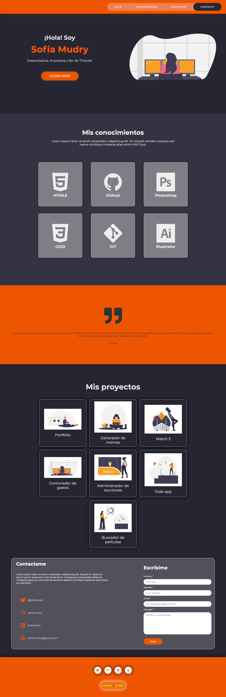

# Portafolio de Ada

### Este proyecto esta realizado para mostrar un ejemplo de como seria un portafolio para la entrega final del modulo 01 de Ada

### Si quieres ver como me quedo puedes darle click a este [enlace](https://sofiamudry.github.io/01-modulo-proyecto-portafolio/.) o puedes hacerlo desde [acá](https://practical-torvalds-23b93b.netlify.app/)

 

***

### Si quieres tener el código en tu computadora, deberas de seguir estos passos en tu terminal.

 - Ir a [Repositorio](https://github.com/sofiamudry/01-Modulo-Proyecto-Portafolio)
 - Darle click al botón de forkear
 - Darle click al botón de Code 
 - Copiar la url
 - Abrir tu terminal y poner el comando de **git clone<url>**
 - Entrar a la carpeta del proyecto en tu IDE.

 ### Este proyecto no necesita la instalación de ninguna dependencia, por ahora!

  

 ***

 ### Este debería ser el resultado final de tu instalación 

 

  

 ***

 ### Este portafolio fue desarrollado para las chicas de la cursada 6 de Ada, Agradezco a [Leydy](url) la ayuda proporsionada!

### De Sofi con 🧡
Para Ustedes!